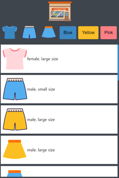
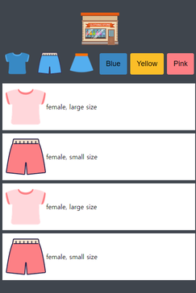
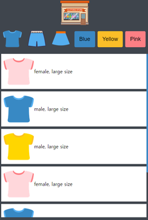

# mini Shopping Web

## Project

- 개요 : HTML, CSS, JS로 간단한 쇼핑몰 웹을 제작하고 있습니다.
- 기술 : HTML, CSS, JavaScript
- 기간 : 8시간

### 주요 기능

1. Button 클릭 시 List 필터링
2. logo 클릭 시 All List

### Screen Shot

|             |                before                 |                 after                  |
| :---------: | :-----------------------------------: | :------------------------------------: |
| ColorFilter |  |  |
| TypeFilter  |  |  |

---

### mini Shop Link

Click [here](https://won-jin-lee.github.io/shopping-Web)
